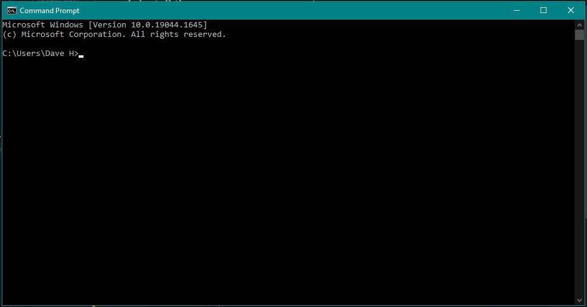

# Nibble Technology Ltd
Python Developers Test

This package contains a small python project with a gap that you will
need to fill in. This task should take between 10 and 30 minutes. You are not
expected to complete this under exam conditions, so feel free to refer to
any resources you need.

If you don't complete the task fully, please submit what you have done,
for discussion.

Your instructions are as follows:


## 1. Install the necessary components

You will need to have Python installed. The project requires pytest, which is
listed in requirements.txt. It is normally installed via pip.

You can do this however you like, but at Nibble we often use venv in a shell:

- _"in a shell"_ would probably mean just in a cmd type window. The `venv`
 creates a virtual environment, this stops you from installing things globally
 (and is highly recommended for all projects). If working in GitPod and using
 the CI template, there is no need to do the first two lines, just install
 directly.


```
python -m venv venv
. venv/bin/activate
pip install -r requirements.txt
```


## 2. Run the unit tests

- When using a `venv`, again, in your setup not necessary. These are things that
 you would need to keep in mind for VSCode.

```
. venv/bin/activate
pytest -v
```

You should see that the tests fail, as the function does not return the
expected result. It is your job to fix the code so the tests pass!


## 3. Fix the code

Take a look in `project.py` and you will see that the function `add_tuple_lists`
has not been implemented. Fill in the function so that it returns the expected
result. Feel free to add any helper functions if you need to, but make sure they
are well documented.

Refer to the code in `test_cases.py` for examples of how the function
should work.


## 4. Re-run the unit tests

```
. venv/bin/activate
pytest -v
```

The tests should now all pass. If they do, well done! If not, head back to
step 3.


## 5. Bonus task!

If you would like, modify the function so that it can accept any number of lists
as arguments. To verify that the new function works correctly, add some more
test cases to `test_cases.py` that demonstrate the new behaviour.


## 6. Task complete!

Now that you have implemented the function, please send your completed
project back to us at Nibble via email.

At a minimum, you should send `project.py` (and `test_cases.py` if you made any
changes). If you prefer, zip up the whole folder and send that.
